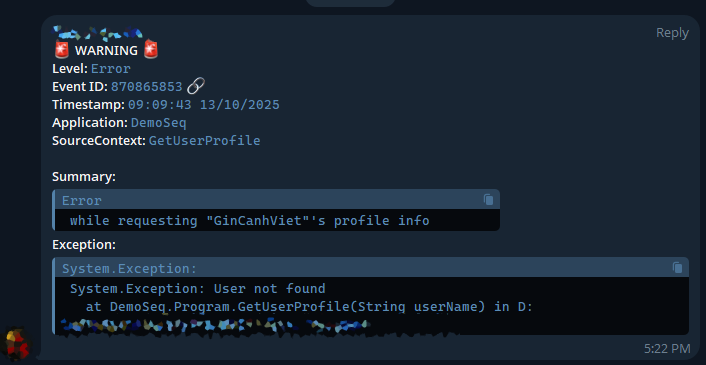
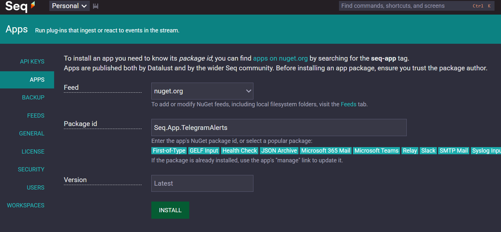
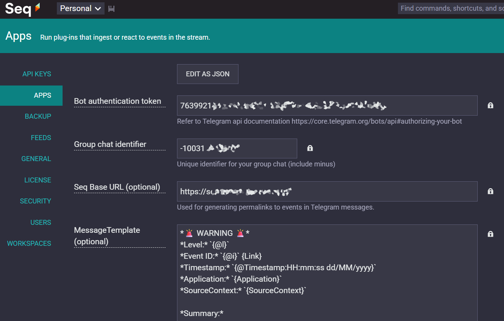

# Seq.App.TelegramNotifier
[](https://www.nuget.org/packages/Seq.App.TelegramNotifier/)

[](https://github.com/ToHoaiBao/Seq.App.TelegramNotifier/actions/workflows/dotnet.yml)

A Seq app for sending alerts to Telegram via the Telegram Bot API. This app allows you to forward log events or notifications from Seq directly to a Telegram chat or group, making it easy to receive real-time alerts on your devices.

*This project is inspired by and references code from Seq.App.Telegram. Initially, I used that project, but it did not support Seq's standard template syntax and could only access event data from a manually mapped dictionary. Therefore, I created this project, which uses the official Seq.Syntax logic for template processing.*

## Features
- Send log events from Seq to Telegram chats or groups
- Template syntax support
- Customizable message formatting
- Socks5 proxy support
- Throttling support to prevent alert spam
- Easy configuration via the Seq UI

## Template Syntax Support
This app supports most of the basic template syntax for formatting messages sent to Telegram.

- **Access Seq event properties** directly in your message template.
- **Standard properties:**
	- `Level`, `RenderedMessage`, `@Timestamp`, `Properties`, etc.
- **Short forms:**
	- `@l`, `@x`, `@t`, `@i`, `@p`, `@mt`, etc.
- **Custom properties:**
	- Example: `{Application}`, `{SourceContext}`, `{User}`, etc.

	These properties such as `{Application}`, `{SourceContext}`, `{MachineName}`, etc. must be enriched in your logger configuration to be available in the event data.

- **Scalar functions:**
	- Functions like `Substring()` are supported (others not fully tested).

For more details, see: https://datalust.co/docs/template-syntax

## Getting Started

### Prerequisites
- [Seq](https://datalust.co/download) instance
- A Telegram bot token (create via [@BotFather](https://t.me/botfather))
- The chat ID of your target Telegram chat or group.

	Add your bot to your group. Send a message. Then invite [@ShowJsonBot](https://telegram.me/ShowJsonBot) or [@RawDataBot](https://telegram.me/RawDataBot) into your chat and it will send you a message. Copy id value from chat section including leading minus. chat section example:
	```json
	"chat": {
	"title": "Your telegram Group Name",
		"type": "group",
		"all_members_are_administrators": true,
		"id": -123456789	// Use this ID to target the group or topic
	}
	```

### Installation
1. In Seq, go to **Settings > Apps > Install from NuGet** and search for `Seq.App.TelegramNotifier`.
2. Or build the project and use the generated `.nupkg` file in `bin/Release`.

### Configuration
- **Bot Token**: The token provided by @BotFather.
- **Chat ID**: The ID of the chat or group to receive alerts.
- **Message Template**: (Optional) Customize the message format.
- **Throttling**: (Optional) Configure to limit alert frequency.


## How to Use
After installing the app into Seq, follow these steps:

1. **Add a new instance:** In Seq `(settings/apps)`, click the **Add instance** button to create a new instance of the Telegram Alerts app.
2. **Fill in the parameters:** Enter the required information as guided (Bot Token, Chat ID, etc.) and save the instance. Make sure your bot has been added to your group.

### Example Message Template for Error Notifications
You can use the following message template as a reference for error notifications:

```
*🚨 WARNING 🚨*
*Level:* `{@l}`
*Event ID:* `{@i}` {Link}
*Timestamp:* `{@Timestamp:HH:mm:ss dd/MM/yyyy}`
*Application:* `{Application}`
*SourceContext:* `{SourceContext}`

*Summary:*
```{RenderedMessage}```
*Exception:*
```{Substring(@x, 0, 150)}...```
```



> **Note:**
> The `{Link}` property is a custom property provided by this app. It generates a direct link to the event in Seq and is displayed in Telegram as a 🔗 icon.
>
> You can also create your own custom properties by downloading the source code and modifying the `GetDynamicProperties` method in the `MessageFormatter` class.

---

## License
MIT

## Author
ToHoaiBao